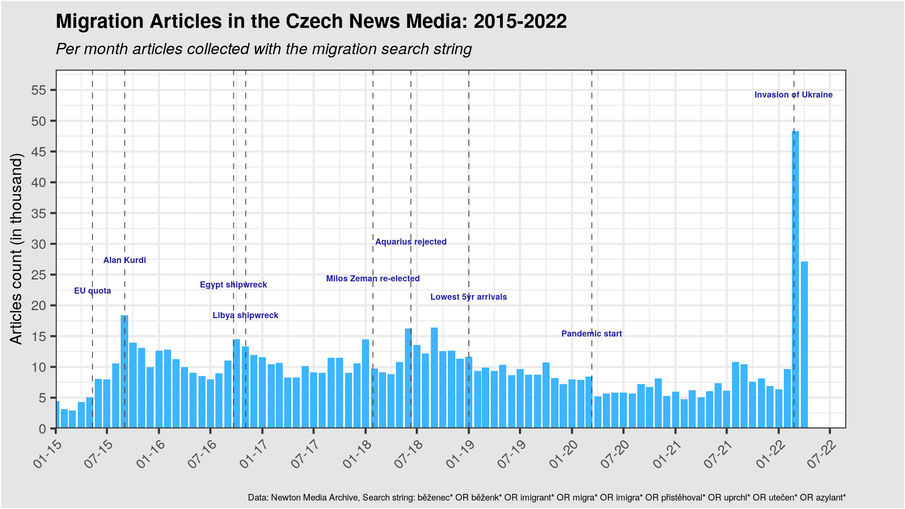
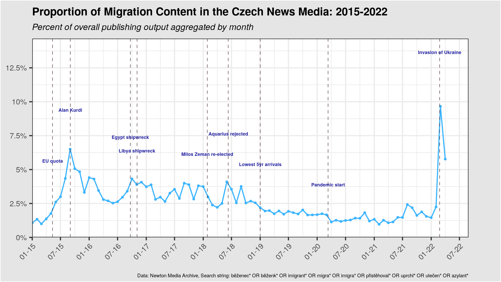
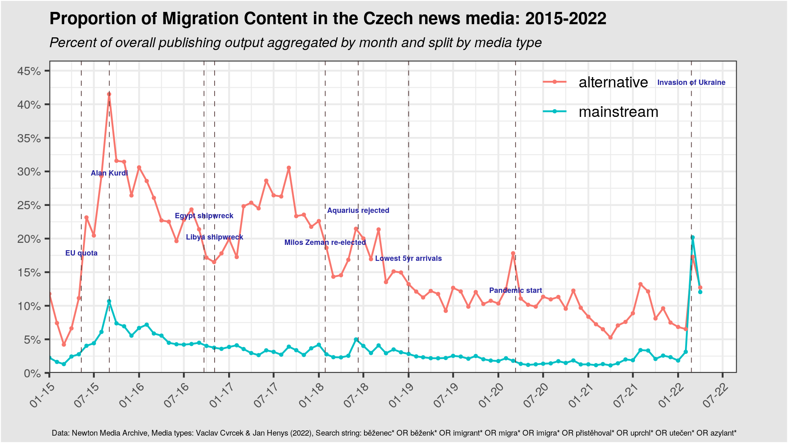
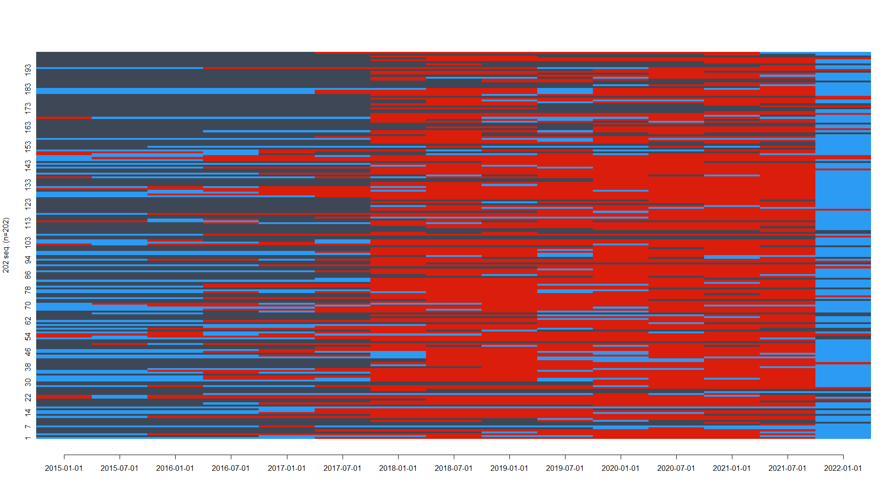
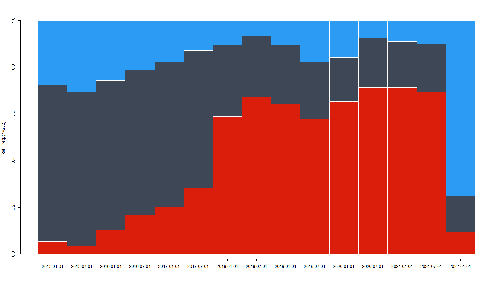
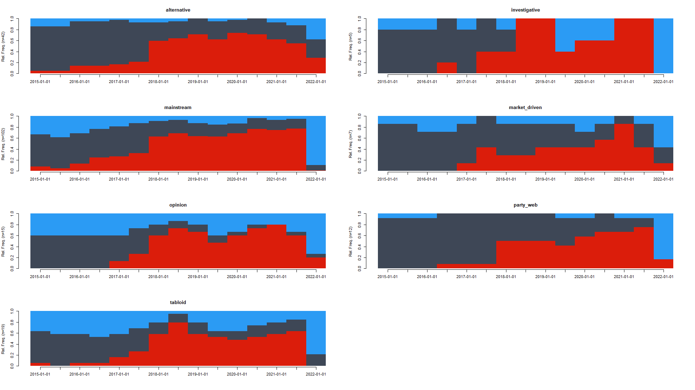

```{=tex}
\newpage

\pagenumbering{gobble}
```
# Abstract {.unnumbered}

The Czech media landscape has experienced a profound transformation in the past decade. Mainstream outlets have been affected by ownership concentration, political pressure, and technological changes. At the same time, low entry barriers allowed the emergence of online and *alternative* journalism, which, perhaps surprisingly, has tended to be antagonistic, rather than supportive, towards marginalized communities [@jirak2020; @stetka2021a; @moravec2020]. In addition, the country has one of the lowest levels of media trust in Europe [@newman2021; @volek2018].

Following recent computational social science and corpus linguistics scholarship, we use extensive source material to investigate the evolution of discourse across time [@cvrcek2021; @theocharis2021; @edelmann2020]. Previous studies within the Czech context have been primarily qualitative [@prchováhrzová2021; @kotišová2017] or relied on relatively few data points of comparison [@kluknavská2021; @chouliaraki2017]. Our data include the entire population of the media coverage of migration, consisting of more than 880,000 articles from the Czech press, online, TV, and radio, and "alternative" media outlets from January 2015 to May 2022.

Discourse concerning refugees, asylum seekers, immigrants, and migrants -- RASIM, following @baker2008 has been thoroughly studied, especially in English. This contribution focuses on the often-polarizing language around migration in the Czech Republic during and after the so-called European refugee crisis. To this end, it uses the method of sequence analysis to investigate the evolution of distinct linguistic patterns in the usage of labels pertaining to forced migration (*refugees*) and voluntary migration (*migrants*) in the Czech media, with a particular attention paid to the difference between the *mainstream* and *alternative* media outlets.

```{=tex}
\newpage

\pagenumbering{arabic}
```
# Introduction

## Emergence of the Czech "alternative" media

In the last decade, the Czech media environment has seen substantial changes that shaped media ownership and processes responsible for news production. On the one hand, local business tycoons purchased large mainstream media publishing houses such as Mafra or Ringier [@kotisova2021]. These developments prompted debate of journalistic autonomy and ethics and caused a decline in the press freedom rankings [@hájek2015]. Secondly, owing to the relative ease of news creation in the age of Web 2.0, Czech media gradually matured into the *hybrid media system model* proposed by @Chadwick2017.

As a result, together with traditional mainstream media outlets, Czech media landscape is cohabited by a substantial amount of online "alternative" media catering to various audiences. In the environment of one of the lowest levels of media trust in Europe [@newman2021], new alternative outlets, such as *Parlamentní Listy* (*The Parliament Letters*)[^1], have experienced remarkable growth, rivaling that of the mainstream press. Despite being implicated in spreading disinformation by researchers and media watchdogs, *Parlamentní Listy* has benefited from the increased post-2015 salience of immigration during the so-called "European migration crisis" [@bojovic2021].

[^1]: Despite its evocative name, there is no link between the media and the Czech Parliament.

A substantial amount of media sociology literature has been devoted to the theorization of the alternative media, with most of the scholarship having a normative character. In this conceptualization, the proliferation of alternative media is conducive to liberal democracy by strengthening the public sphere through marginalized groups' empowerment. However, as emerging research argues, this characterization is not entirely reflective of most alternative outlets in the Czech Republic and elsewhere in Europe [@pekácek2019; @holt2019].

Overall, the Czech mediasphere has expanded significantly in the past decade. This is reflected in the 2021 report by Mediaguru, which notes a general increase in media consumption, with a monthly internet engagement of over eight million people [@prehleda]. While some forms of traditional media, such as print and radio, have experienced a year-on-year decline in audience, television increased its reach and consumption time and averaged four hours daily. Furthermore, public engagement is only one indicator - the quantity of media supply is somewhat astounding. For instance, Newton Media Archive indexes more than 1600 online and offline media in the news category [@archive2021].

# Literature review

## Migration coverage & public attitudes

Despite the crucial role played by social media in the communication of the topic of migration, non-social media continue to be essential actors in this process. The literature regarding their real-world impact is relatively robust and indicates that migration coverage does impact not only public attitudes but also the support for the parties of the populist right. This process seems to be influenced by the different salience, sentiment, and framing of the coverage @lecheler2019. In the Czech context, a two-wave panel survey by @stetka2021 found that exposure to commercial TV stations and, perhaps counterintuitively, to a plurality of media sources seems to increase anti-immigrant attitudes. The media type does seem to matter, however, and the consumption of Czech public media is correlated with more positive attitudes towards immigration in the study of @kondor2022.

## Media migration discourse research in Czech Republic

Since different characteristics of media coverage seem to be linked to different properties, how has this aspect been researched so far? Despite the sheer amount of media outlets and migration articles, most studies seem to either employ qualitative methodology or content analysis of a limited sample.[^2] For instance, @sedláková2017 uses a constructionist approach to study the Czech Radio portrayals of refugees in mid-2015, arguing that the framing of the reportage contributed to the "moral panic" by using labels such as "wave" or a "flood." @tamchynová2017 uses qualitative discourse analysis of selected media articles to study the mechanisms of securitization of migration coverage. Framing is also investigated in an article by @kovár2020 using manual quantitative content analysis. The results suggest that while the security threat frame of migration is predominant in the studied Czech media, tabloids seem to invoke the frame significantly more often than the economic frame.

[^2]: This is nonetheless not specific to the research in the Czech context. Qualitative studies seem to predominate in the international research on migration coverage, as argued by @seo2022.

A study by @urbániková2020 combines manual content analysis with a hierarchical clustering method. It reaches broadly similar conclusions, albeit with more distinction, by adding *humanitarian* and *burden on host society* frames. In a relatively surprising finding, the authors argue that Czech daily newspapers of opposing political orientations tend to have similar framing of their migration coverage. They hypothesize that this might be due to the limited resources of the newsrooms, which tend to reuse the content of foreign media outlets relatively uncritically. An international comparative study of @reinemannevent-2019 manual content analysis to investigate populist communication strategies in the coverage of migration in 2016-2017 across ten countries, including the Czech Republic. It found that the prevalence of populist key messages seemed unrelated to the actual level of asylum seekers in the individual countries.

Another international comparative research of @kluknavská2021 on the claims about migration made in Czech, Slovak, and Austrian media provides further detail, analyzing the space media provide to the voices of different types of political actors and refugees themselves. A relatively novel combination of methods to explore this issue was employed by @bartoszewicz2022. In the first stage, authors employ lexicon-based automatic content analysis of selected frames in the media corpus, tracing their intensity over the 2015-2018 period. Using this knowledge, the authors then conducted focus group interviews with public members to study participants' perceptions regarding media coverage.

Overall, studies conducted on the functioning of the Czech media ecosystem seem to align with the review of @eberl2018, which found the European reportage to be predominantly negative and conflict-centered. However, as the review notes, most of the research, such as the report by @berry2016, tends to focus on Western Europe and the largest media outlets. This seems to be the same weakness of the studies mentioned earlier, which mostly do not cover the "alternative" media outlets and their discourse on migration.

Furthermore, while studies on framing seem to be relatively popular, less attention has been paid to linguistic features of this media coverage. For instance, unlike @berry2016, none of the studies focus on the linguistic distinction between the label of *migrant* and *refugee*. However, as the research by @elmerot2019 and @elmerot2021 argues, the specific choice of nouns and adjectives matters when it comes to the *othering* of different social groups in the Czech media discourse.

## Sequence analysis and its applications

This study uses sequence analysis to investigate the pattern of migration labeling in the Czech media coverage from 2015-2022 longitudinally and across different media types. In essence, sequence analysis aims to uncover distinct longitudinal transition patterns between different categorical states. As a method, sequence analysis has roots in the 1970s human genomic studies, but it was first employed a decade later in social sciences by @abbott1983 in a qualitative manner to study narratives in historical sociology. With the increase in computing power and availability of data sources such as panel studies, sequence analysis started to be more quantitative when examining social phenomena. Nevertheless, the body of research using sequence analysis seems to be primarily focused on the occupational, educational, and health trajectories of individuals. It does not seem to be so widely used in the Natural Language Processing (NLP) domain, which focuses on analyzing textual data @sequence2018.[^3]

[^3]: An interesting exception is @iuchi2021, which combines NLP with sequence analysis to study biological data; however, this is clearly outside the social science domain.

# Methodology

## Media dataset construction

To obtain the media data, we search for relevant articles in the Newton Media database, containing nearly 4000 media outlets, using API access. To only extract the news concerning migration, we use the boolean search string inspired by @reinemannevent-2019.[^4] We choose the period of January 2015 to May 2022 because it covers two distinct periods of increased refugee influx to Europe - the first one, concerning primarily refugees from Syria, Iraq, and Afghanistan, in 2015-2017, and the most recent one, concerning the Ukrainian refugee influx post-Russian invasion in February 2022.

[^4]: The following search string was used: běženec\* OR běženk\* OR imigrant\* OR migra\* OR imigra\* OR přistěhoval\* OR uprchl\* OR utečen\* OR azylant\*. The only difference from the authors' string has been the exclusion of stems of terms related to integration, assimilation, and deportation, as these seemed to yield a lot of irrelevant articles.

These search parameters yield over 870 000 articles, spread unequally over time, as Figure 1 shows. In the same period, we can obtain counts from the API for the total published content of all of the media in our sample, which is over 32 million. Our migration corpus thus forms a relatively minor part of the overall media output, only approaching the 10% limit in February 2022, as Figure 2 highlights. This seems to be because most of the media in the Newton Media Archive do not exclusively focus on the news but also sports, regional reporting, and cultural affairs. However, it is essential to note that the migration coverage seems to be pervasive overall and does sometimes appear even with these seemingly irrelevant media categories.





## Media type labels

In order to investigate the difference in labeling sequences between different media types, we use the dataset kindly provided by Václav Cvrček from Charles University. This dataset is based on a previously created typology by @slerka2018 as a part of the *Mapa Médií* (Media Map) project, which distinguishes eight different media types[^5] altogether and involves two human coders. We select only the media where both coders agree. As a next step, we join the media types dataset with our media articles dataset, resulting in 289 labeled media outlets. While this is a significant reduction from the 3890 distinct media outlets in our original dataset, we still seem to be able to capture the most important ones. This is reflected in the resulting dataset of 376 534 articles (a subset of the original with 871 236 articles) with an identified media type. Furthermore, we merge the category of *anti-system* and *political tabloids* into a broader category of *alternative media*, as some of the media in the latter category (such as *Parlamentní Listy*) position themselves antagonistically toward the *mainstream*, as noted by @stetka2021a. Figure 3 shows the stark distinction between the proportion of coverage dedicated to migration-related news in *mainstream* and *alternative* media.

[^5]: The original website with the method description is now accessible only through a web archive. However, a scholarly journal article by Josef Šlerka on this typology should be published in late 2022.



## Textual pre-processing

In the next phase, we clean the textual data with a regular expression (Regex) pattern[^6] to remove unnecessary symbols and extra whitespace. We then use the migration search string again to subset only the terms of interest, followed by tokenization of one word per document, resulting in a long format dataset. We then aggregate the dataset into six-month-long periods, which seems to offer a suitable compromise between granularity (i.e., level of detail) and the number of migration terms within each media outlet. From the resulting grouped counts, we select the top three terms for each of the individual media outlets[^7].

[^6]: The following pattern seemed to yield the best results for Czech texts: "\<(.\|\\n)\*?\>\|[\^ěščřžýáíéóúůďťňĎŇŤŠČŘŽÝÁÍÉÚŮĚÓa-zA-Z0-9.?! ]"

[^7]: For better clarity, we filter out media that have been labeled as *irrelevant*, *other*, or *institutional website* by Václav Cvrček et al.

## Lexicon construction

Since Czech is a highly inflected language (with 14 different word forms), we are left with 358 unique terms, which we then manually label as either *refugee-related* (128 terms) or *migration-related* (230 terms). Using this lexicon of recoded labels, we again group the dataset, getting the top label for each media in six-month-long periods. This is the crucial data point, which indicates whether the specific news outlet used more *refugee-related* or *migration-related* labels in the given period. Subsequently, we transform the dataset from long to wide format, where rows represent each of the 202 media outlets and columns each of the 6-month sub-periods. Finally, we replace the missing values with a third possible sequence state - *no mention,* which indicates that the media outlet did not likely provide any migration coverage in that period.

## Sequence analysis

The wide dataset format created in the previous phase is suitable for transforming into the sequence object, which is the first step in the sequence analysis workflow. We are using the TraMineR package implemented in R @Ritschard2021, with results discussed in detail in the following section.

# Results & Discussion

## Sequences combined

Initial examination of the sequence dataset reveals some limitations of this study - about 39% of all possible sequence states are *no mention*. This means that a substantial portion of the 202 media outlets only covered migration in some of the six-month sub-periods (or did not yet exist in some of the years). Only 59 media in our dataset used at least one of the relevant labels consistently without interruption between 2015 and 2022. This is apparent in Figure 4, which visualizes all of the sequences and where *dark grey* color indicates *no mention* values, *red* color represents *migration-related* terms, and *blue* stands for *refugees-related* terms.



A more consistent pattern emerges when the state distribution plot is consulted (see Figure 5). In 2015-2016, most of the media in our dataset did not cover migration news. However, when comparing sequence states of those who did, most seemed to employ *refugee-terms*. The situation has gradually changed between 2017-2021, specifically by the dominant usage of *migration-terms*. This changed abruptly in the first months of 2022 after the invasion of Ukraine when the coverage of the majority of our media tended to be again dominated by *refugee-terms*.



\newpage

## Sequences grouped by media type

If we group the state distribution into specific media types, we end up with Figure 6. Interestingly, as opposed to the suggestions from existing literature, there does not seem to be a substantial difference between the *alternative* and *mainstream* media in this aspect. While *mainstream* outlets seem to have been using *refugee-terms* more intensively (as opposed to relative silence on the part of the *alternative*) in the 2015-2016 period, the proportional increase in the usage of *migration-terms* in 2017-2021 seems to be strikingly similar. Nevertheless, the first indications show a significantly higher propensity of *mainstream* media to use *refugee-terms* in the context of the war in Ukraine. However, since our dataset ends with April 2022 (inclusive), it seems to be essential to gather more data in the following months before making more robust comparisons with the previous periods of migration news coverage.

Finally, apart from the limitations mentioned above, it is important to again emphasize that the media labels used in this study are based on an evolving and unpublished work, which only includes several hundred labeled media from a larger population of several thousand. This is reflected in the relatively small number of media of a certain type in our dataset, such as *investigative* (n = 5) and *market-driven* (n=7). Therefore, this sequence analysis cannot provide a complete overview of the Czech media ecosystem in regards to the reporting on migration.

{alt="State distribution plot grouped by media type."}

\newpage

# Acknowledgements

This study was financially supported by the OeAD Aktion Österreich-Tschechien program realized during the November 2021-March 2022 stay at the Department of Communication, the University of Vienna, under the supervision of Jörg Matthes.

\newpage

# References

\vspace{6pt}
