# Czech Media Migration Discourse Research, 2015-2022
## Repository of scripts, workflow and output

***
### Authors:

*Ondrej Pekacek, Charles University*  
*Irene Elmerot, Stockholm University*

***

> NOTE: Some data could not be stored in this repository, due to their proprietary nature. This primarily affects media data obtained from Newton Media API.

***

*Overview last updated: 14 July 2022*

## **Structure:**

## 1. Extraction of data

- Media articles
  - Newton Media database: Migration articles and counts of all media content (API)
  - Disinformation Articles (EUvsDisinfo & newsplease scrape)
- Facebook (media and journalists)
  - Facebook Ads API
  - Facebook public pages posts (Crowdtangle API) *work in progress*
- Twitter (media and journalists)
  - Twitter tweets (Twitter Academic API)
  - Twitter account information & followers (Twitter Academic API)
  - Twitter counts (Twitter Academic API)
- Instagram (media and journalists) *work in progress*
  - Public accounts posts (Crowdtangle API)
  - Public accounts information (igramscraper)
- Complementary datasets *work in progress*
  - Relevant parliamentary speeches (Hlidac Statu API)
  - Real media owners (Hlidac Statu API)
  - GDELT (Big Query API)
  - Corpora (SYN2020, representative corpus of Czech language)
  - Google media political ads (Big Query API)
  - Salience of migration over time (gtrendsR & Wikimedia API)
- Visual data of posts *work in progress*
  - Media, Twitter, Instagram (including stories), Facebook

## 2. Data pre-processing *work in progress*

- Media articles
  - Preprocessing: Removal of uneeded characters/symbols (Regex)
  - Lemmatization, POS tagging & other text features (Lindat UDPIPE API) *work in progress*
  - Labeling of media types (provided by Cvrcek & Henys, last update February 2022)

## 3. Exploratory data analysis *work in progress*

- Media articles
  - Counts of all migration content thorough time
  - Proportion of migration content thorough time on all coverage
  - How did the average lenght of the article differ across media types? *work in progress*

- Twitter
  - Filter media migration tweets and display in time
  - Longitudinal comparison with overall migration Tweet counts

- Extra
  - Visualization of dependency trees of selected UDPIPE'd sentences (JS Treex)

## 4. Data Analysis *work in progress*

- What are the most prominent entities in the migration coverage?
  - Named Entity Recognition (Lindat NameTag 2 model)
- What are the most similar words to migration-related terms and how did the meaning evolve?
  - Word Embedding model (Wang2Vec/Word2Vec, GloVe, Fasttext)
  - Word shift graphs (shifterator)
- Has the overall sentiment evolved over time / differed across the media types?
  - Sentiment Analysis (Czech SubLex, BERT Czert B model)
- How did the media types differ in semantic grouping?
  - Semantic Analysis (UCREL Semantic Analysis System)
- What were the articles' key words?
  - Keyword extraction (Lindat KER API / local TF-IDF)
- Which media were most active in spreading disinformation about migration?
  - Document similarity (Doc2Vec) with disinfo dataset
- To what extent was the media discourse similar to political actors' speeches?
  - Document similarity (Doc2Vec) with parliamentary speeches
- How does the usage of linguistic features differ across media types?
  - UDPIPE word features data
- What difference exists in the discourse/framing of the refugees across media types?
  - Word collocations and concordances (KWIC)
  - LDA topic modeling
- Did the usage (and pattern) of migration vs refugee terms differ across time and media types?
  - Lexicon with regex
  - Sequence analysis
- What objects were most common in the migration coverage?
  - Image object recognition (YOLOv4/v5)
- What online networks/communities exist around key media and across types?
  - Network analysis on Twitter data and users' behavior
- What videos are being recommended by YouTube for key Czech media accounts?
  - Network analysis of YT recommendations

### 5. Writing it up

- Stockholm June 2022 conference abstract & presentation
- CCL Vienna June 2022 presentation
- Article 1 draft (NER & KWIC concordances) *work in progress*

***

## Project workflow diagram:

```mermaid
graph TD;

  style newton fill:#2b9bf4,color:#fff,stroke:#b4263d,stroke-width:1.5px
  style disinfo fill:#2b9bf4,color:#fff,stroke:#b4263d,stroke-width:1.5px
  style twitter fill:#2b9bf4,color:#fff,stroke:#b4263d,stroke-width:1.5px
  style media fill:#2b9bf4,color:#fff,stroke:#b4263d,stroke-width:1.5px
  style fb_ads fill:#2b9bf4,color:#fff,stroke:#b4263d,stroke-width:1.5px
  style crowdtangle fill:#2b9bf4,color:#fff,stroke:#b4263d,stroke-width:1.5px
  style soc_media fill:#2b9bf4,color:#fff,stroke:#b4263d,stroke-width:1.5px
  style visual_data fill:#2b9bf4,color:#fff,stroke:#b4263d,stroke-width:1.5px
  style gdelt fill:#2b9bf4,color:#fff,stroke:#b4263d,stroke-width:1.5px
  style gdelt fill:#2b9bf4,color:#fff,stroke:#b4263d,stroke-width:1.5px
  style complementary fill:#2b9bf4,color:#fff,stroke:#b4263d,stroke-width:1.5px
  style semantic fill:#2b9bf4,color:#fff,stroke:#b4263d,stroke-width:1.5px
  style sentiment fill:#2b9bf4,color:#fff,stroke:#b4263d,stroke-width:1.5px
  style vision fill:#2b9bf4,color:#fff,stroke:#b4263d,stroke-width:1.5px
  style wiki_gtrends fill:#2b9bf4,color:#fff,stroke:#b4263d,stroke-width:1.5px
  style network fill:#2b9bf4,color:#fff,stroke:#b4263d,stroke-width:1.5px
  style complementary_analyses fill:#2b9bf4,color:#fff,stroke:#b4263d,stroke-width:1.5px
  style raw_data fill:#2b9bf4,color:#fff,stroke:#ed1c24,stroke-width:1.5px
  style regex fill:#2b9bf4,color:#fff,stroke:#ed1c24,stroke-width:1.5px
  style udpipe fill:#2b9bf4,color:#fff,stroke:#ed1c24,stroke-width:1.5px
  style clean_data fill:#2b9bf4,color:#fff,stroke:#ed1c24,stroke-width:1.5px
  style eda fill:#2b9bf4,color:#fff,stroke:#ed1c24,stroke-width:1.5px
  style udpipe fill:#2b9bf4,color:#fff,stroke:#ed1c24,stroke-width:1.5px
  style nlp fill:#2b9bf4,color:#fff,stroke:#ed1c24,stroke-width:1.5px
  style counts fill:#2b9bf4,color:#fff,stroke:#ed1c24,stroke-width:1.5px
  style length fill:#2b9bf4,color:#fff,stroke:#ed1c24,stroke-width:1.5px
  style lda fill:#2b9bf4,color:#fff,stroke:#ed1c24,stroke-width:1.5px
  style ner fill:#03fc9d,color:#fff,stroke:#ed1c24,stroke-width:1.5px
  style analyzed_data fill:#2b9bf4,color:#fff,stroke:#ed1c24,stroke-width:1.5px
  style analysis fill:#2b9bf4,color:#fff,stroke:#ed1c24,stroke-width:1.5px
  style ccl fill:#2b9bf4,color:#fff,stroke:#ed1c24,stroke-width:1.5px
  style stockholm fill:#2b9bf4,color:#fff,stroke:#ed1c24,stroke-width:1.5px
  style 1st_article fill:#2b9bf4,color:#fff,stroke:#ed1c24,stroke-width:1.5px
  style finish fill:#2b9bf4,color:#fff,stroke:#ed1c24,stroke-width:1.5px
  style communication fill:#2b9bf4,color:#fff,stroke:#ed1c24,stroke-width:1.5px
  style labels fill:#2b9bf4,color:#fff,stroke:#ed1c24,stroke-width:1.5px
  style collocs fill:#03fc9d,color:#fff,stroke:#ed1c24,stroke-width:1.5px
  style concord fill:#2b9bf4,color:#fff,stroke:#ed1c24,stroke-width:1.5px
  style doc_sim fill:#2b9bf4,color:#fff,stroke:#ed1c24,stroke-width:1.5px
  style word_sim fill:#2b9bf4,color:#fff,stroke:#ed1c24,stroke-width:1.5px
  style freq fill:#03fc9d,color:#fff,stroke:#ed1c24,stroke-width:1.5px
  style trees fill:#2b9bf4,color:#fff,stroke:#ed1c24,stroke-width:1.5px
  style kw fill:#2b9bf4,color:#fff,stroke:#ed1c24,stroke-width:1.5px
  style fact_check fill:#2b9bf4,color:#fff,stroke:#ed1c24,stroke-width:1.5px
  style ws_graphs fill:#2b9bf4,color:#fff,stroke:#ed1c24,stroke-width:1.5px
  style med_owners fill:#2b9bf4,color:#fff,stroke:#ed1c24,stroke-width:1.5px
  style parl_speeches fill:#2b9bf4,color:#fff,stroke:#ed1c24,stroke-width:1.5px
  style ola fill:#2b9bf4,color:#fff,stroke:#ed1c24,stroke-width:1.5px
  style med_demograph fill:#2b9bf4,color:#fff,stroke:#ed1c24,stroke-width:1.5px
  style idioms fill:#2b9bf4,color:#fff,stroke:#ed1c24,stroke-width:1.5px
  style yt fill:#2b9bf4,color:#fff,stroke:#ed1c24,stroke-width:1.5px
  style google fill:#2b9bf4,color:#fff,stroke:#ed1c24,stroke-width:1.5px

  newton[Newton Media API: <br> full media articles and content count] --> media([News media output])
  labels[Media type labelled dataset: <br> Vaclav Cvrcek et al.] ---> media
  disinfo[EUvsDisinfo verified migration disinformation: <br> newsplease scrape] --> media
  twitter[Tweets & Account info: <br> Twitter API] --> soc_media([Migration communication of <br> journalistic actors on social media])
  yt[YouTube channels data: <br> YouTube API] --> soc_media
  crowdtangle[FB & Instagram public posts: <br> Crowdtangle API] --> soc_media
  media ----> raw_data[(RAW DATA)]
  soc_media ---> raw_data
  visual_data[Visual data: <br> web scraping & Selenium] --> complementary([Contextual data])
  gdelt[Global Database of Events, <br> Language and Tone: <br> GDELT API] --> complementary
  ola[Online media readership: <br> Netmonitor.cz OLA data] --> complementary
  fb_ads[Paid FB advertising <br> by Czech media: <br> Facebook Ads Library API] --> complementary
  google[Paid Google advertising <br> by Czech media: <br> Facebook Ads Library API] --> complementary
  med_demograph[Online media demographics: <br> Similarweb.com data] --> complementary
  wiki_gtrends[Salience of migration: <br> pageviews - Wikipedia views <br> gtrends - Google Trends <br> Eurobarometer data] --> complementary
  med_owners[Czech media ownership: <br> real media owners database <br> Hlidac Statu API] --> complementary
  fact_check[Migration PolComm 1: <br> fact-checked claims of <br> political actors about migration: <br> demagog.cz API] --> complementary
  parl_speeches[Migration PolComm 2: <br> speeches about migration <br> in the parliament: <br> Hlidac Statu API] --> complementary
  complementary --> raw_data
  raw_data ===> regex([Text cleaning and preprocessing: <br> Regex pattern])
  regex ==> udpipe([Lemmatization, UPOS & linguistic features: <br> UDPIPE model])
  udpipe ===> clean_data[(PROCESSED DATA)]
  clean_data ====> analysis([Data Analysis])
  eda([Exploratory Data Analysis]) === analysis
  nlp([Natural Language Processing]) ===== analysis 
  complementary_analyses([Complementary analyses]) === analysis 
  counts[Counts over time <br> and media type] --> eda
  length[Content length over time <br> and media type] --> eda
  trees[Key sentences dependency trees: Treex] --> eda
  network[Network analysis of <br> online media <br> YouTube channels: <br> igraph] --> complementary_analyses 
  vision[Object detection: <br> YOLO model] --> complementary_analyses
  sentiment[Sentiment analysis: <br> Czech Subjectivity Lexicon & <br> Czert BERT model] --> nlp
  ws_graphs[Word shift graphs: <br> shifterator] --> nlp
  semantic[Semantic analysis: <br> UCREL USAS] --> nlp
  idioms[Idiomatic expressions: <br> custom lexicon] --> nlp
  ner[Named Entity Recognition: <br> NameTag 2 model] --> nlp
  lda[Topic modeling <br> genisim LDA unsupervised model <br> seededlda semisupervised model] --> nlp
  collocs[Collocations: <br> quanteda] --> nlp
  concord[KWIC Concordances: <br> quanteda] --> nlp
  doc_sim[Document similarity: <br> doc2vec] --> nlp
  word_sim[Word embeddings: <br> wang2vec] --> nlp
  freq[Key term frequencies: <br> custom migration-terms <br> lexicon] --> nlp
  kw[Key Word extraction: <br> TF-IDF] --> nlp
  analysis =====> analyzed_data[(ANALYZED DATA)]
  analyzed_data ====> communication{PUBLISHING & OUTREACH}
  ccl[Vienna University <br> Computational Communication Lab <br> presentation <br> June 2022] --- communication
  stockholm[Stockholm University <br> Powers of Language <br> conference presentation <br> June 2022] --- communication
  1st_article[First article draft <br> summer 2022] --- communication
  communication ====> finish((PROJECT COMPLETION))

```

